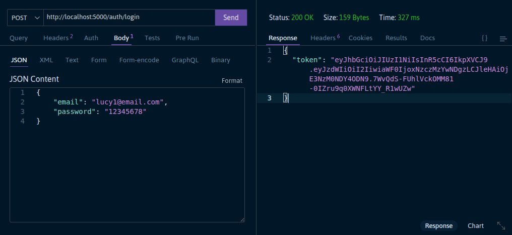
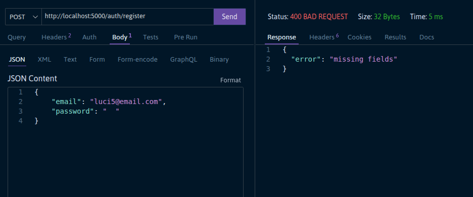

# Secure Notes

A full-stack note-taking application with JWT authentication and encrypted passwords. Built as a portfolio project to demonstrate backend development skills.

🔗 **Live demo:** https://securenotes-ma55.onrender.com

---

## Tech Stack

**Backend**
- Python & Flask
- PostgreSQL + SQLAlchemy
- JWT authentication (PyJWT)
- Password hashing with bcrypt
- Flask-CORS

**Frontend**
- HTML, CSS, JavaScript
- Responsive design

---

## Features

- User registration and login
- JWT-secured API endpoints
- Password hashing with bcrypt
- Full CRUD for notes (create, read, update, delete)
- Each user can only access their own notes
- Responsive frontend

---

## API Endpoints

### Auth
| Method | Endpoint | Description |
|--------|----------|-------------|
| POST | `/auth/register` | Register a new user |
| POST | `/auth/login` | Login and receive a JWT token |

### Notes (requires JWT)
| Method | Endpoint | Description |
|--------|----------|-------------|
| GET | `/notes/` | Get all notes for the authenticated user |
| POST | `/notes/` | Create a new note |
| GET | `/notes/:id` | Get a specific note |
| PATCH | `/notes/:id` | Update a note |
| DELETE | `/notes/:id` | Delete a note |

---

## Project Structure

```
secure-notes/
├── assets/
│   └── screenshots/
│       ├── login.png
│       ├── get-notes.png
│       └── register-400.png
├── src/
│   ├── middleware/
│   │   └── auth_guard.py
│   ├── models/
│   │   ├── user.py
│   │   └── note.py
│   ├── routes/
│   │   ├── auth.py
│   │   └── notes.py
│   ├── config.py
│   └── __init__.py
├── frontend/
│   ├── login.html
│   ├── register.html
│   ├── notes.html
│   ├── notes.css
│   └── notes.js
├── run.py
└── requirements.txt
```

---

## API testing (Thunder Client)

### POST /auth/login


### GET /notes/ 


### POST /auth/register 



